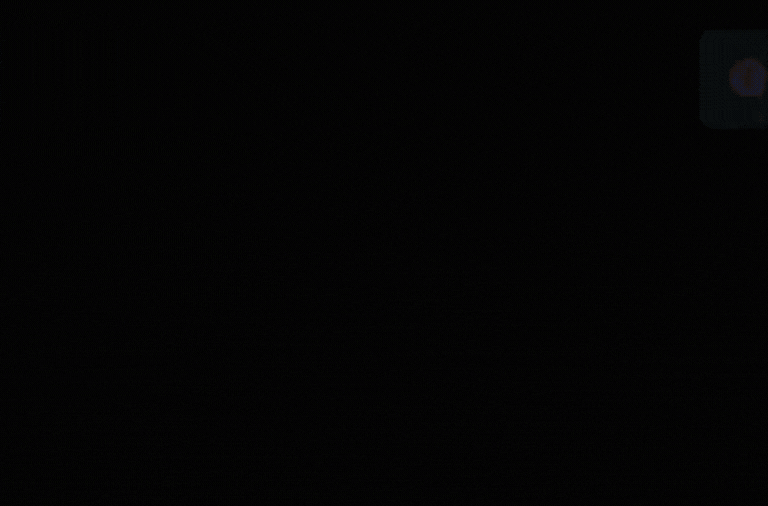

# DyToast

A dynamic toast notification package for Laravel.
## Installation

Install the package using Composer:

```bash
composer require hafizulislamhfz/dy-toast
```

After installed, publish the toast resources:

```bash
php artisan dytoast:publish
```

Modify Your app.blade.php (or Main Layout)
In the main layout file (resources/views/layouts/app.blade.php). To ensure the toast system works correctly, you need to include the dy-toast component before any scripts or dynamic content that may trigger a toast.

```bash
<!DOCTYPE html>
<html lang="en">
<head>
    {{-- head --}}
</head>
<body>
    {{-- Load DyToast early to ensure it initializes before usage --}}
    @include('components.dy-toast.toast')
    {{-- or --}}
    <x-dy-toast.toast />
</body>
</html>
```

## Usage

### Trigger Toast Notifications

Use the toast in controllers or anywhere within Laravel:

```php
use Hafizulislamhfz\DyToast\Facades\Toast;

// Display a success message
Toast::success('Operation completed successfully!');
toast('Operation completed successfully!');

// Display an error message
Toast::error('Something went wrong!');
toast('Something went wrong!', 'error');

// Display a warning message
Toast::warning('This is a warning!');
toast('This is a warning!', 'warning');

// Display an info message
Toast::info('Some useful information here!');
toast('Some useful information here!', 'info');

```

Use the toast in script:

```js
<script>
    // Display a success message
    toast('Operation completed successfully!');
    toast.success('Operation completed successfully!');

    // Display an error message
    toast('Something went wrong!', 'error');
    toast.error('Something went wrong!');

    // Display a warning message
    toast('This is a warning!', 'warning');
    toast.warning('This is a warning!');

    // Display an info message
    toast('Some useful information here!', 'info');
    toast.info('Some useful information here!');
</script>
```

## Preview


## License

DyToast is open-source software licensed under the [MIT license](LICENSE).
